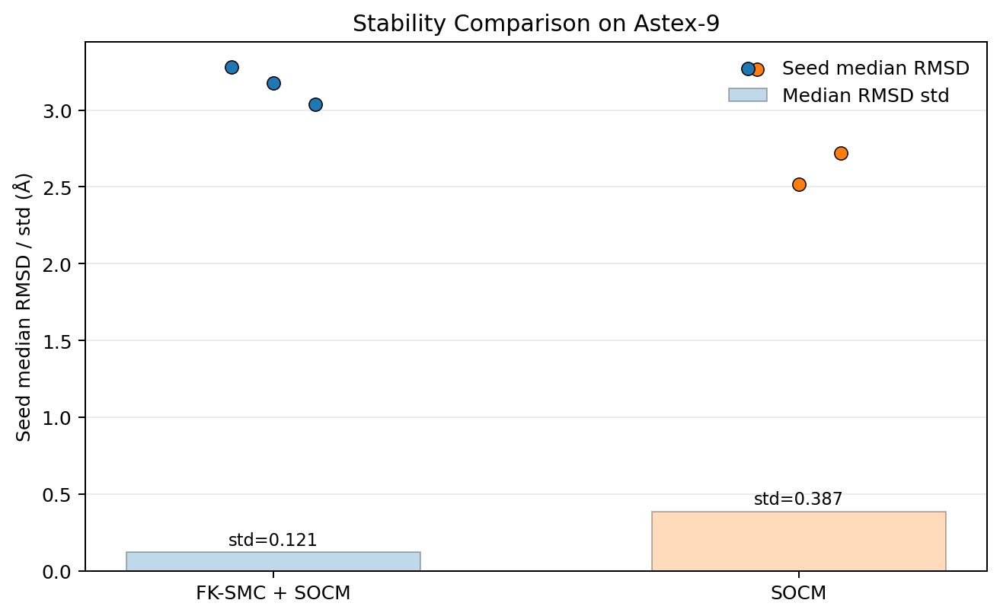
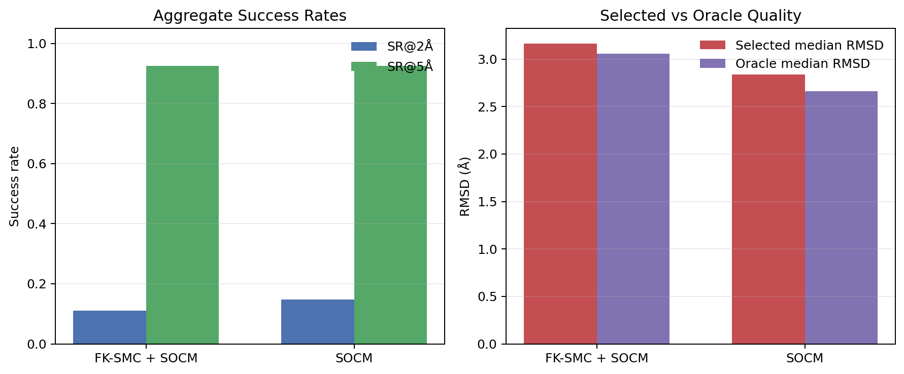
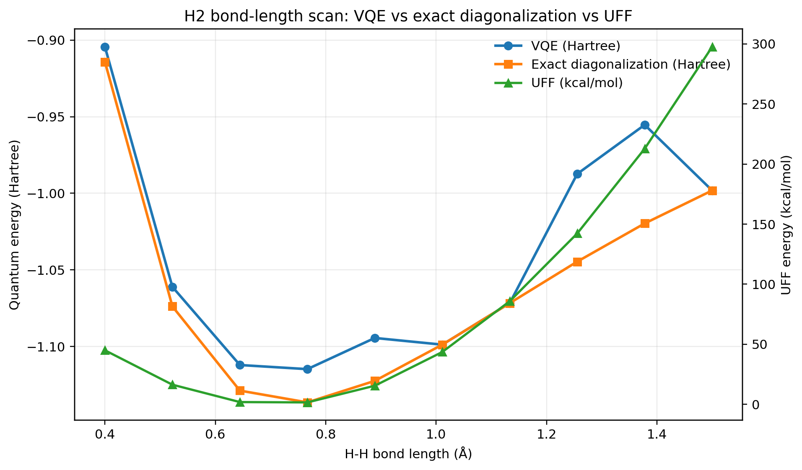

# PoseRefineLab

PoseRefineLab is a research codebase for protein-ligand pose refinement, benchmark analysis, and failure-mode auditing. The repository combines the current SAEB docking pipeline, benchmark/report generation utilities, and a compact QM negative-result study used to test whether xTB rescoring improves final pose ranking.

The public repository is intentionally scoped to the code and artifacts that support the current technical conclusions: stable benchmark execution, explicit search-vs-selection diagnosis, and reproducible report packages under `reports/`.

## Repository At A Glance

- `src/` — main docking, refinement, scoring, and benchmark code
- `scripts/` — report generation, audits, and benchmark helpers
- `reports/` — curated docking and QM result packages for external review
- `docs/` — current project status and technical notes
- `quantum/` — QM/xTB utilities used in the pilot rescoring study

## Current Technical Position

- `SOCM` is slightly better on aggregate docking accuracy
- `FK-SMC + SOCM` is more stable across seeds
- hard failures are primarily `search-limited`, not just reranking failures
- MMFF outlier contamination is handled by auto-disable safeguards
- QM rescoring is retained as a pilot negative result, not a claimed improvement

## Installation

Use Python 3.10+.

```bash
python -m venv .venv
. .venv/bin/activate
pip install -r requirements.txt
```

On Windows PowerShell:

```powershell
python -m venv .venv
.venv\Scripts\Activate.ps1
pip install -r requirements.txt
```

## Dependencies

Core runtime dependencies are listed in `requirements.txt`.

Main packages:

- `torch`
- `numpy`
- `pandas`
- `matplotlib`
- `seaborn`
- `scikit-learn`
- `biopython`
- `rdkit`
- `fair-esm`

## What This Repo Contains

- `src/`
  - main SAEB/PoseRefineLab implementation
  - refinement, scoring, MMFF safeguards, and benchmark logic
- `scripts/`
  - benchmark utilities
  - audit scripts
  - `build_reports.py` to rebuild the shared report packages
- `docs/`
  - current project status and technical notes
- `reports/`
  - final report packages for:
    - docking
    - quantum
- `quantum/`
  - QM/xTB-related scripts and lightweight notes used to build the QM report package

## Current Project Position

The docking project currently supports a stability-focused claim more strongly than an accuracy-superiority claim.

Supported by the current evidence:

- `SOCM` remains slightly better on aggregate docking accuracy
- `FK-SMC + SOCM` is materially more stable across seeds
- hard failures are now diagnosed as primarily `search-limited`
- MMFF outlier contamination is handled by auto-disable safeguards

The QM line is kept as a documented pilot negative result:

- the xTB rescoring workflow works end-to-end
- but ligand-only and pocket-cluster rescoring did not improve pose ranking on the tested cases

## Key Reports

Docking package:

- `reports/docking/report.md`
- `reports/docking/stability_comparison.png`
- `reports/docking/gap_audit_targets.png`
- `reports/docking/summary_metrics.png`

Quantum package:

- `reports/quantum/report.md`
- `reports/quantum/qm_rmsd_comparison.png`
- `reports/quantum/qm_delta_vs_selected.png`
- `reports/quantum/h2_vqe_scan.png`

## Selected Figures

### Docking: stability and aggregate benchmark view





### Quantum: H2 bond-length scan



## Benchmark Snapshot

Current public report package highlights:

- `SOCM` is slightly better on aggregate accuracy
- `FK-SMC + SOCM` is more stable across seeds
- hard targets remain primarily `search-limited`
- QM rescoring is currently documented as a pilot negative result

## Rebuilding The Reports

From the repository root:

```bash
python scripts/build_reports.py
```

This regenerates:

- `reports/docking/`
- `reports/quantum/`

when the required benchmark CSV inputs and QM summary inputs are available locally.

## Benchmark Entry Points

Main benchmark CLI:

```bash
python src/run_benchmark.py --help
```

Astex-10 FK-SMC + SOCM wrapper:

```bash
python src/run_astex10_fksmc_socm.py --help
```

Search-vs-selection audit:

```bash
python scripts/search_selection_gap_audit.py --help
```

## Notes

- Intermediate Kaggle outputs, experimental scratch results, archives, and legacy submission folders are intentionally excluded from GitHub.
- The repository is meant to present the current working code and the current report packages, not every historical artifact.
